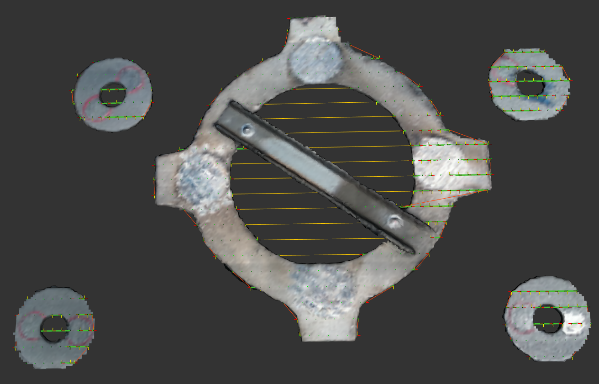
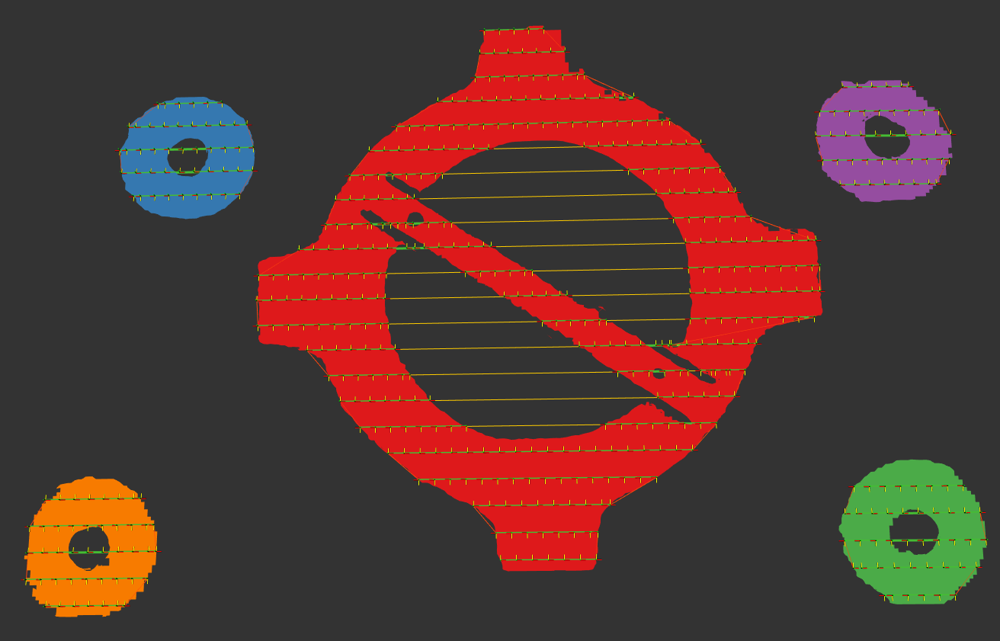

# Exercise 1a

Experiment with the GUI provided in `noether`.
Your efforts should utimately produce output tool paths that look something like the images below:

## Tasks

- Load [the `multi_component.ply` mesh](../meshes/multi_component_mesh.ply)
- Create a raster tool path over the whole mesh
- Create a raster tool path over each individual component of the mesh
- Create a raster tool path over each individual component of the mesh, where the tool paths are generated on a plane rather than the mesh surface
- Modify the output tool path such that the end of one raster is adjacent to the start of the next raster (i.e., the raster has a snake-style shape)
- Modify the output tool path such that the x-axis of the waypoints flips from one stroke of the raster to the next
- Add an approach and departure point above the start/end of each raster
- Visualize the tool path lines and modified mesh

# Solution

The solution tool path planner configuration file can be found [here](exercise_1a_solution.yaml).
Load this file into the GUI to see the combination of mesh modifiers, tool path planner, and tool path modifiers used to accomplish the tasks listed above.
