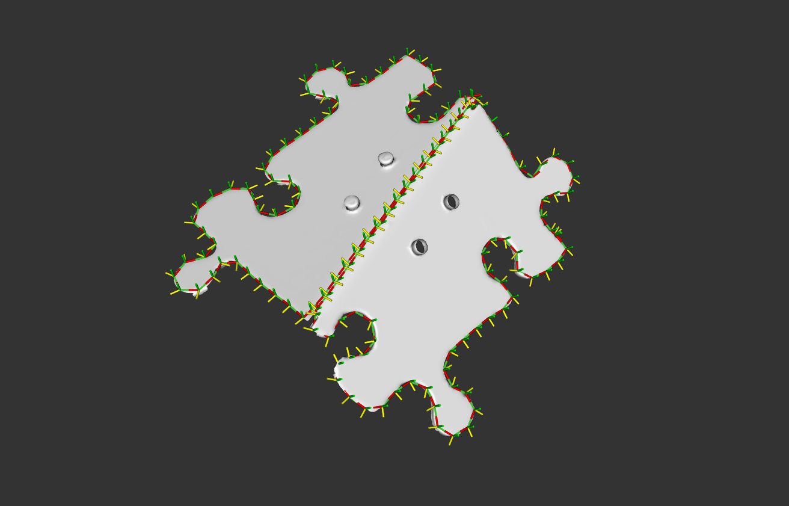
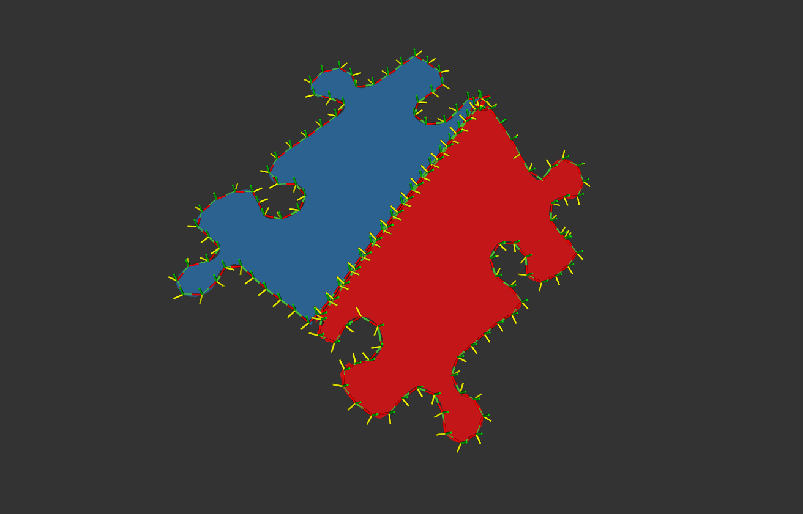
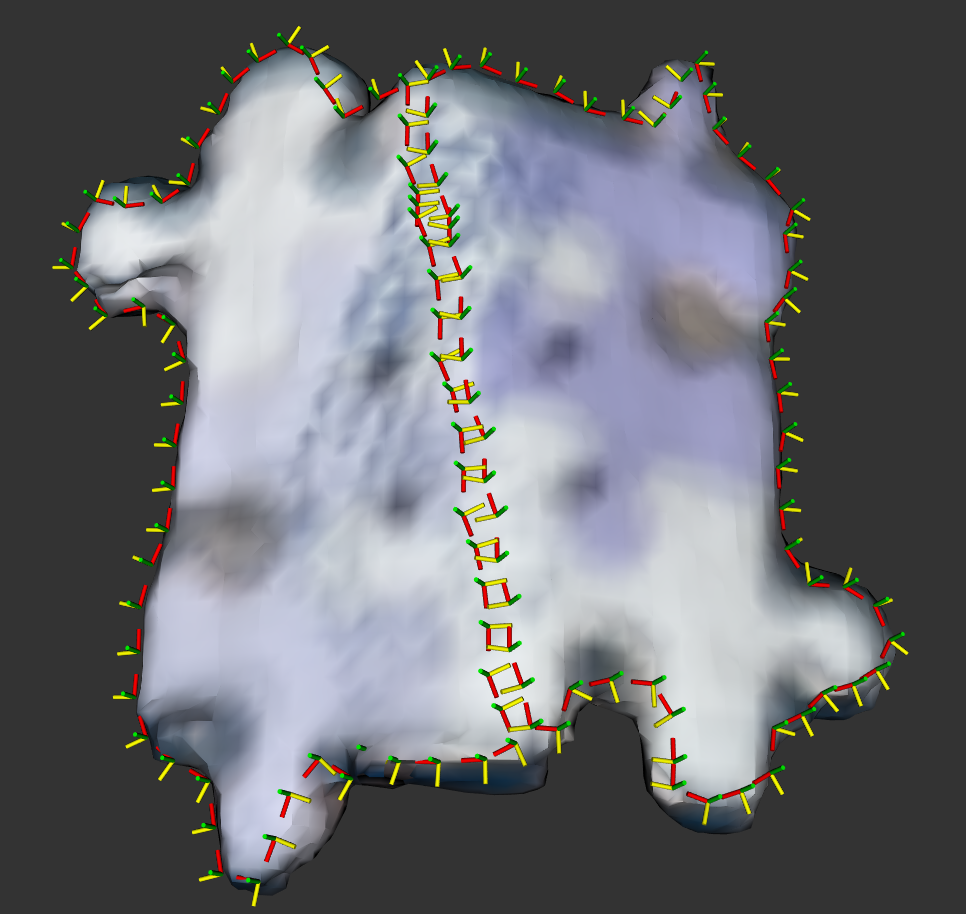
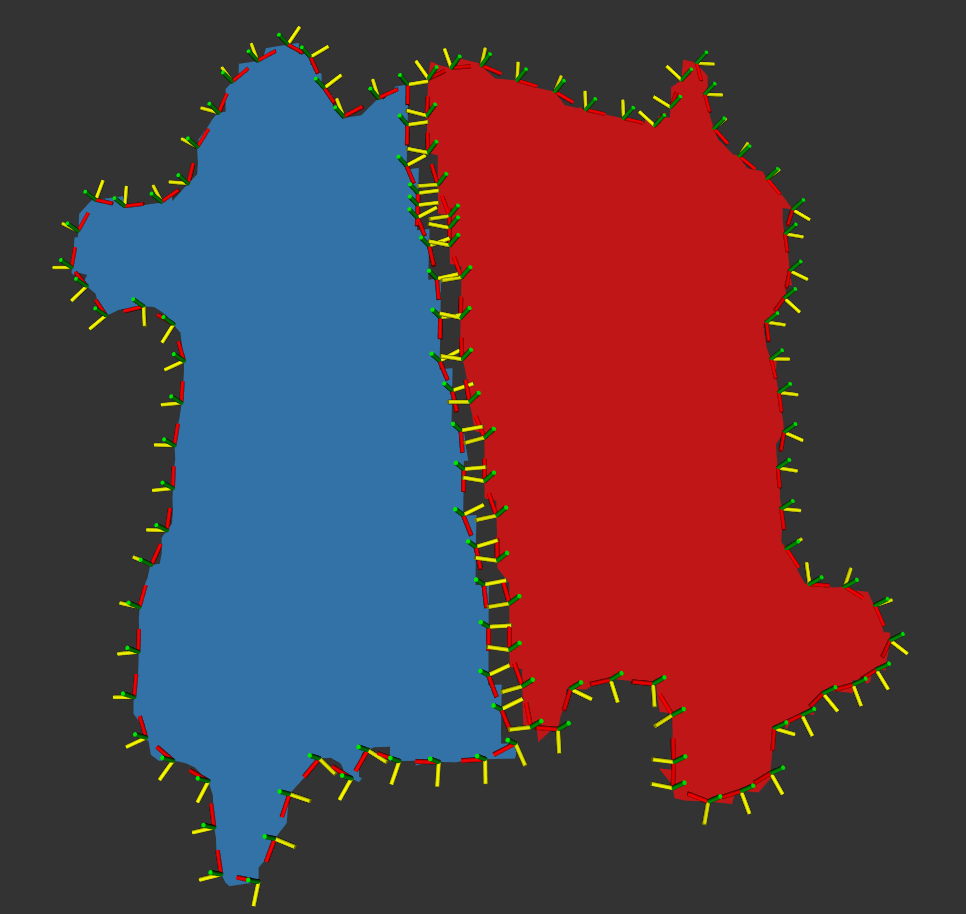

# Exercise 1b

Create a tool path for edge routing on a puzzle piece component using existing tool path planning components.
There are two meshes of the puzzle piece: one with high-resolution and one with much lower resolution and more noise.
Adapt your approach from the high-resolution mesh to work with the low-resolution mesh.

> Note: the approach for this exercise is a bit hacky, so don't be afraid to think outside the box.
The intended result should look like the images below:

## Tasks

- Load [the high resolution puzzle piece mesh](../meshes/puzzle_piece_detailed.ply)
- Consider how to generate the cleanest tool paths all the way around the mesh that would be suitable for routing the entire edge
  - Hint: think about flattening the mesh to its two consituent primitive features (this is the hacky part)
  - Consider filling any holes that might exist in the mesh so as not to generate extra edge paths
- Plan a boundary tool path around the outsides of the part
- Sample the tool path uniformly
- Make sure that the x-axis of the tool path waypoints follow the direction of the edge all the way around the part

## Challenge Tasks

- Repeat this process for a [much noisier mesh of the puzzle piece](../meshes/puzzle_piece.ply)
- Using the provided solution's approach to this project, what could you implement to remove the tool paths running down the middle of the part?

## Solution

The solution tool path planner configuration file can be found [here](exercise_1b_solution.yaml)
