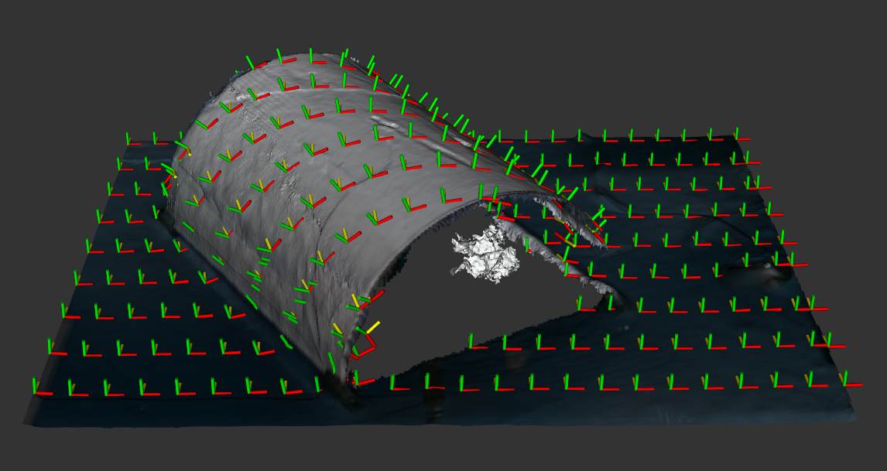
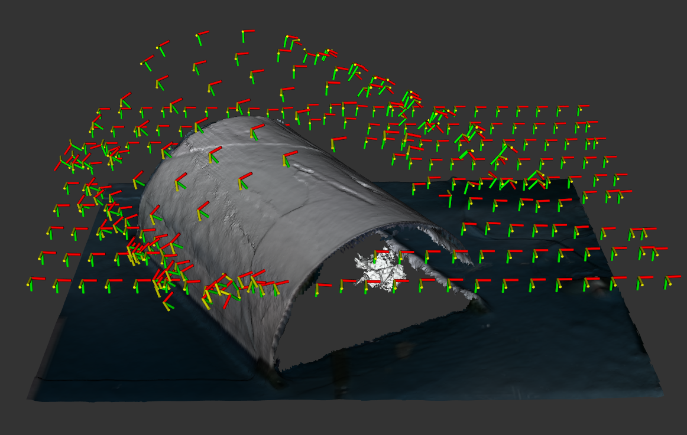

# Exercise 2a
Create a custom widget to configure the existing `OffsetModifier` tool path modifier to function as module that applies a camera standoff transform to tool path waypoints (assumed to be on the surface of the mesh).
Your modifier should take a tool path like the image below:



and turn it into a tool path that looks like the following image:



## Tasks

- Familiarize yourself with the definition of the class in the [header file](../include/noether_roscon_2024/exercise_2a)
- Complete the lines marked `TODO` in the [source file](../src/exercise_2a/camera_standoff_tool_path_modifier_widget.cpp)
- Uncomment the lines adding this plugin in the [plugin source file](../src/plugins.cpp)
- Compile
- Test by applying this modifier after a raster tool path planner using [this mesh](../meshes/cylinder.ply)

> Note: Remember to add the name of our plugin library to the environment variable that allows `noether` to find libraries providing plugins:
```
export NOETHER_PLUGIN_LIBS=noether_roscon_2024_plugins
```

## Challenge Tasks

- Make it such that the user can specify the camera standoff distances in inches rather than meters
