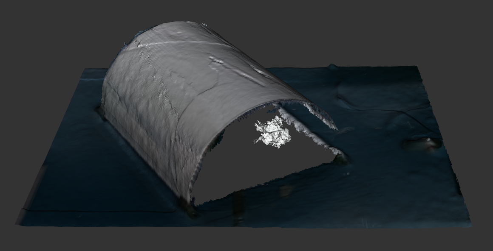
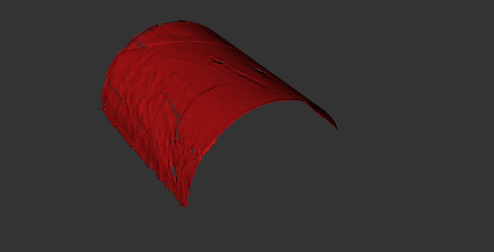

# Exercise 2b

Create a mesh modifier that extracts cylindrical sub-meshes and projects inlier vertices onto the fitted model.
Create a UI widget to configure this mesh modifier in the `noether` GUI.
You should be able to segment the cylinder like in the images below:





## Tasks

- Familiarize yourself with the class definitions in the [header files](../include/noether_roscon_2024/exercise_2b)
- Complete the lines marked `TODO` in the [source files](../src/exercise_2b)
- Uncomment the lines adding this plugin in the [plugin source file](../src/plugins.cpp)
- Compile
- Test by applying this modifier before a raster tool path planner using [this mesh](../meshes/cylinder.ply)
  - Don't spend too much time tuning your parameters for cylinder extracting.
  The next exercise will add a component that will make this much easier.
- Remember to visualize the modified mesh with `View -> Mesh -> Modified` or with the shortcut `Ctrl+Shift+M`

> Note: Remember to add the name of our plugin library to the environment variable that allows `noether` to find libraries providing plugins:
```
export NOETHER_PLUGIN_LIBS=noether_roscon_2024_plugins
```

## Challenge Tasks

- The specification of the cylinder axis direction is too restrictive for general use; remove it while still allowing the mesh modifier to work correctly
- Add tool tips (https://doc.qt.io/qt-5/qwidget.html#toolTip-prop) to the UI to give the user more information about the function of each parameter
