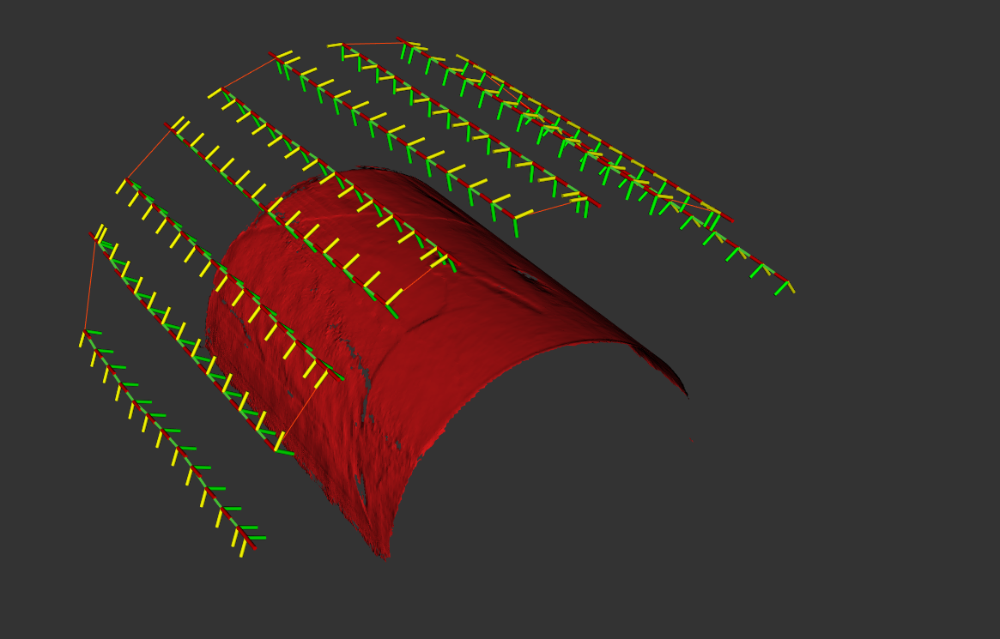
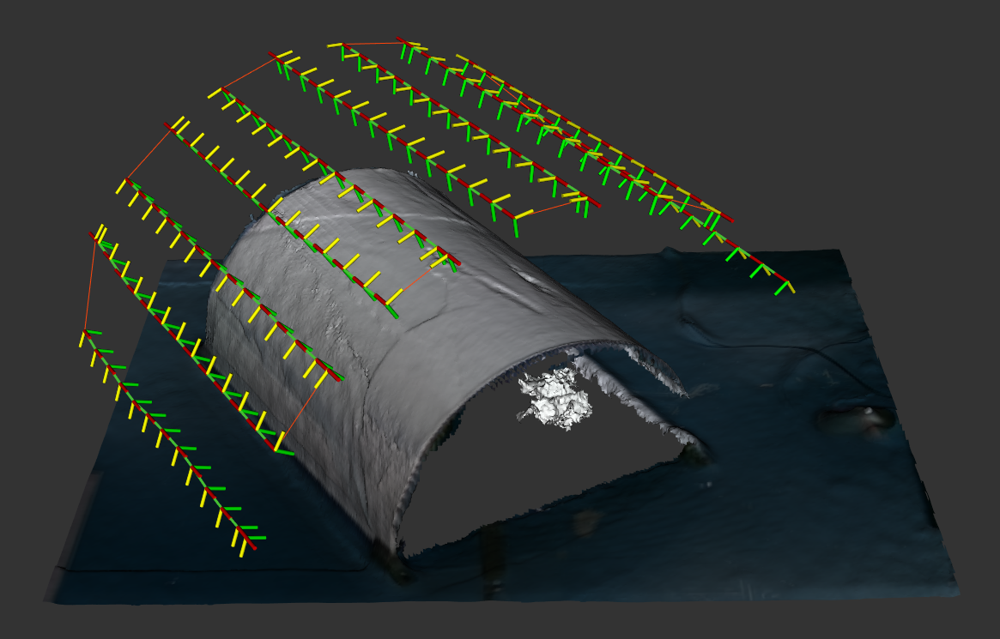

# Exercise 2c

Create a no-op tool path planner that simply does not return any tool paths.
This capability will be useful for more quickly testing mesh modifiers.
Once complete, tune your cylinder extraction mesh modifier while using this no-op tool path planner.
When the tuning is done, put all of the pieces together to produce a camera inspection tool path for this cylindrical component.
The results should look like the images below:





## Tasks
- Complete the lines marked `TODO` in the [header files](../include/noether_roscon_2024/exercise_2c) and [source files](../src/exercise_2c)
- Uncomment the lines adding this plugin in the [plugin source file](../src/plugins.cpp)
- Compile
- Test by using this tool path planner with the cylinder extraction mesh modifier and camera standoff tool path modifier using [this mesh](../meshes/cylinder.ply)

> Note: Remember to add the name of our plugin library to the environment variable that allows `noether` to find libraries providing plugins:
```
export NOETHER_PLUGIN_LIBS=noether_roscon_2024_plugins
```
